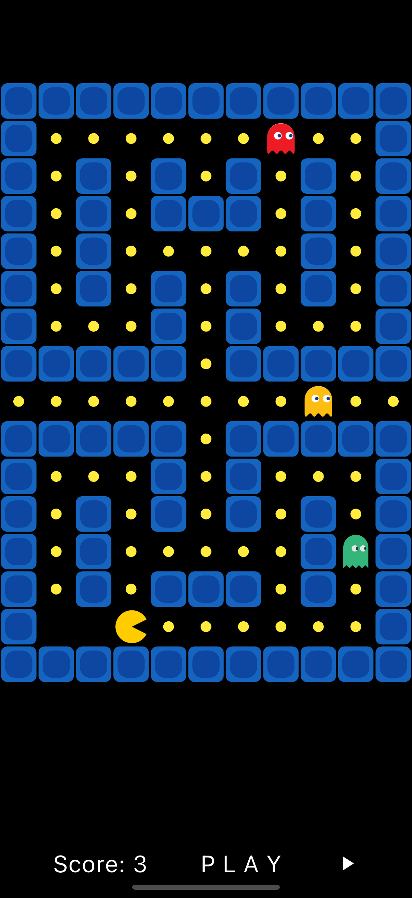

# Pacman 🟡👻

A simple Pacman game built with **Flutter**.  
Collect dots, avoid ghosts, and try to get the highest score!

---

## 🎮 Features

- Classic Pacman gameplay
- Moving ghosts
- Score counter
- Simple and clean UI

---

## 📸 Screenshot

---

## 🚀 Getting Started

1. Clone the repository.
2. Run `flutter pub get` to install dependencies.
3. Use `flutter run` to launch the game.

## License

See the [License](./License) file for details.
